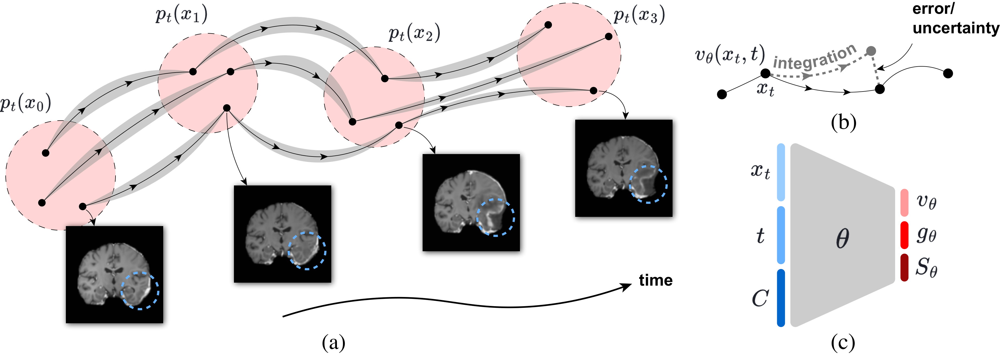

<div align="center">

# Longitudinal Flow Matching for Trajectory Modeling

[](https://aistats.org/aistats2026/)
[](https://arxiv.org/abs/2510.03569)
[](https://niazoys.github.io/longitudinal-flow-matching/)
[](https://opensource.org/licenses/MIT)
[](https://www.python.org/downloads/)
[](https://pytorch.org/)
[](https://lightning.ai/)

**Mohammad Mohaiminul Islam<sup>1</sup>, Thijs P. Kuipers<sup>1</sup>, Sharvaree Vadgama<sup>1</sup>, Coen de Vente<sup>1,2</sup>, Afsana Khan<sup>3</sup>, Clara I. Sánchez<sup>1,2</sup>, Erik J. Bekkers<sup>1</sup>**

<sup>1</sup>University of Amsterdam &nbsp; <sup>2</sup>Amsterdam UMC &nbsp; <sup>3</sup>Maastricht University

[**Paper**](https://arxiv.org/abs/2510.03569) | [**Project Page**](https://niazoys.github.io/longitudinal-flow-matching/) | [**BibTeX**](#citation)



</div>

## Overview

Official implementation of **Interpolative Multi-Marginal Flow Matching (IMMFM)** — a stochastic generative framework for modeling continuous disease trajectories from sparse, irregularly-sampled longitudinal neuroimaging.

IMMFM learns subject-specific progressions as Itô SDEs with three key innovations:

- **Piecewise-quadratic conditional path** — smooth velocity blending between trajectory segments with Lipschitz continuity, replacing discontinuous linear multi-marginal interpolation
- **Learned directional uncertainty** — a jointly-optimized diffusion coefficient that corrects trajectory predictions without biasing drift learning (theoretically guaranteed)
- **Multi-marginal optimal transport via diffeomorphic registration** — topology-preserving spatial alignment as a pathway prior

## Key Results

| Metric | Improvement |
|--------|-------------|
| Anatomical Dice | +1.0% – 4.4% |
| PSNR | +1.5 – 2.2 dB |
| Quadratic path ablation | up to +3.7% DSC |
| 3D ADNI Dice | 94.7% (+3% over 2D) |
| Hausdorff (GBM) | >6 pixel reduction |
| Early AD detection | +9.1% accuracy (18-month lead time) |

## Installation

```bash
git clone https://github.com/niazoys/longitudinal-flow-matching.git
cd immfm
pip install -r requirements.txt
```

Requires Python ≥ 3.10, PyTorch ≥ 2.0, and a CUDA GPU for training.

## Quick Start

```bash
# Stage 1: Train autoencoder
python scripts/ae_training/main_ae_adni.py --config configs/ae_adni.yaml

# Stage 2: Train flow matching on latent trajectories
python scripts/fm_training/run_fm_adni.py --config configs/fm_adni.yaml
```

## Project Structure

```
configs/                    # Self-contained YAML experiment configs
├── ae_{adni,gbm,ms}.yaml         # Autoencoder training
└── fm_{adni,gbm,ms,starmen}.yaml # Flow matching training

scripts/
├── ae_training/            # Autoencoder entry points
└── fm_training/            # Flow matching entry points

src/models/
├── autoencoder/            # UNet autoencoder
├── flow_matching/          # Multi-marginal flow matching, SDE/ODE solvers
└── velocity_field_models/  # Velocity field architectures (VRF, MLP)

datasets/                   # ADNI, Brain GBM, Brain MS, Starmen loaders
utils/                      # Config loading, metrics, general utilities
tests/                      # Smoke tests
```

Model imports use the `src.models.*` namespace. The old top-level `models/` package has been removed.

## Configuration

Configs use [`ml_collections.ConfigDict`](https://github.com/google/ml_collections) loaded from YAML. Override any value from CLI:

```bash
# Flat name (auto-resolved) or explicit dotted path:
python scripts/fm_training/run_fm_adni.py --lr 5e-5 --flow_matching.dim 2048
```

## Training

### Stage 1 — Autoencoder

```bash
python scripts/ae_training/main_ae_adni.py --config configs/ae_adni.yaml
python scripts/ae_training/main_ae_mri.py  --config configs/ae_gbm.yaml
python scripts/ae_training/main_ae_ms.py   --config configs/ae_ms.yaml
```

### Stage 2 — Flow Matching

```bash
python scripts/fm_training/run_fm_adni.py     --config configs/fm_adni.yaml
python scripts/fm_training/run_fm_mri.py      --config configs/fm_gbm.yaml
python scripts/fm_training/run_fm_ms.py       --config configs/fm_ms.yaml
python scripts/fm_training/run_fm_starmen.py  --config configs/fm_starmen.yaml
```

> Flow matching scripts load a frozen autoencoder checkpoint. Update the path in `init_autoencoder()` or config as needed.

ADNI train/validation/test splits are cached at `assets/splits_adni.json`. If an old root-level `splits_adni.json` exists, the ADNI loader copies it into `assets/` and uses the asset copy from then on.

## Datasets

| Dataset | Description |
|---------|-------------|
| [ADNI](https://adni.loni.usc.edu/) | Alzheimer's disease progression (CN → AD) |
| Brain GBM (LUMIERE) | Glioblastoma tumor evolution |
| Brain MS | Multiple Sclerosis lesion progression |
| Starmen | Synthetic morphing shapes (controlled benchmark) |

Set `dataset.dataset_path` in the relevant config to your local data directory.

## Pretrained Models

| Model | Dataset | Link |
|-------|---------|------|
| Autoencoder | ADNI | [Download](https://drive.google.com/XXXX) |
| Autoencoder | Brain GBM | [Download](https://drive.google.com/XXXX) |
| IMMFM | ADNI | [Download](https://drive.google.com/XXXX) |
| IMMFM | Brain GBM | [Download](https://drive.google.com/XXXX) |

## Citation

```bibtex
@article{islam2025longitudinal,
  title={Longitudinal Flow Matching for Trajectory Modeling},
  author={Islam, Mohammad Mohaiminul and Kuipers, Thijs P and Vadgama, Sharvaree and de Vente, Coen and Khan, Afsana and S{\'a}nchez, Clara I and Bekkers, Erik J},
  journal={arXiv preprint arXiv:2510.03569},
  year={2025}
}
```

## Acknowledgements

We thank the author of the following repositories:

- [MMFM](https://github.com/Genentech/MMFM) — Multi-Marginal Flow Matching 
- [conditional-flow-matching](https://github.com/atong01/conditional-flow-matching) — Conditional Flow Matching 
- [ImageFlowNet](https://github.com/KrishnaswamyLab/ImageFlowNet) — Image-level flow matching for longitudinal imaging 

Data used in preparation of this article were obtained from the [Alzheimer's Disease Neuroimaging Initiative (ADNI)](https://adni.loni.usc.edu/).

## License

This project is licensed under the MIT License — see [LICENSE](LICENSE) for details.
